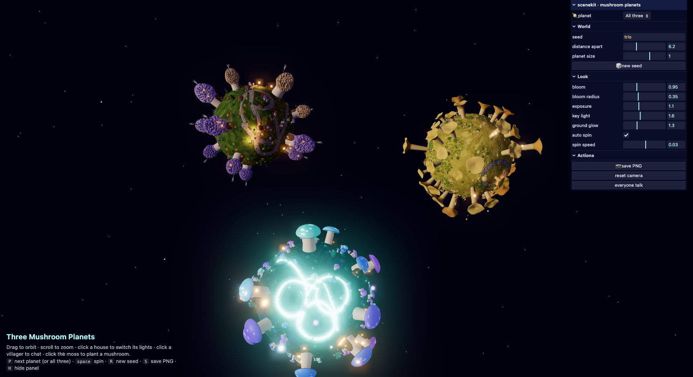

# Mushroom Planets

Three tiny mushroom planets you can fly around, poke and replant, drawn in the
browser with [three.js](https://threejs.org). No build step, no dependencies to
install: plain ES modules, three.js pinned from a CDN.



- **Bioluminescent** — night, glowing cyan rivers, blue and violet mushroom
  houses, spirit orbs, a crescent moon.
- **Purple Morel** — twilight village of honeycomb morel houses with smoking
  chimneys, cobble paths, villagers in knitted sweaters.
- **Golden Chanterelle** — trumpet-shaped golden caps with wavy rims, tall
  chanterelle towers with balconies, a reader on a bench.
- **All three** — the planets together in one view.

## Run

```bash
python3 -m http.server 8477
open http://localhost:8477/
```

Or open `dist/three-planets.html` directly: a single file with the three-planet
view and a settings panel behind the ⚙ button (needs internet for three.js).

## Deploy

`amplify.yml` is set up for AWS Amplify Hosting: connect the repo, and the
build runs `tools/build-single.py` and publishes `dist/` (with `index.html` =
the three-planet page). Any static host that can serve a folder works the same.

## Play

| Do this | Result |
|---|---|
| drag | look around |
| `W` `A` `S` `D` | fly forward / left / back / right (where you are looking) |
| `Q` `E` | sink / rise |
| hold `shift` | fly 4× faster |
| scroll | change the base fly speed |
| click a house | toggles its window lights |
| click a villager | they stop and say something |
| click a spirit orb | it pops and regrows |
| click the moss | plants a new mushroom |
| `P` `space` `R` `C` `H` | next planet · spin · new seed · save PNG · panel |

Planet and seed live in the URL, e.g. `?planet=morel&seed=morel`.

## Layout

```
index.html              the page: planet switcher, panel, tooltip, clicks
scenes/                 one module per planet (+ trio.js composing all three)
lib/                    renderer, free-fly camera, seeded RNG, planet surface, mushrooms, villagers, props, sky, picking
tools/build-single.py   folds everything into dist/three-planets.html
dist/                   generated single-file build (index.html + three-planets.html)
amplify.yml             AWS Amplify Hosting config: build dist/, serve it
```

A scene module exports `id`, `label`, `DEFAULTS`, `RANGES`, `LOOK`, `makeSky()`
and `createWorld(params)`; register it in `SCENES` in `index.html` and it shows
up in the dropdown. Everything random goes through the seeded `Rng`, so a seed
always rebuilds the same world.

## License

MIT
